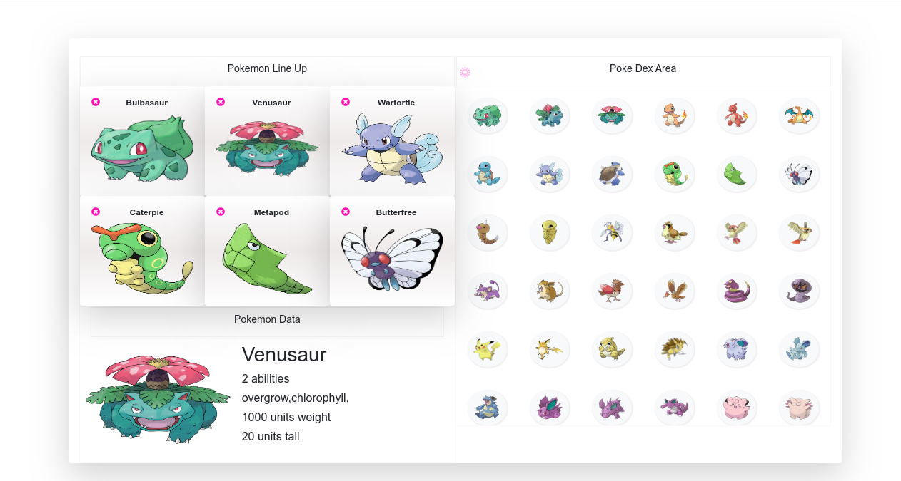

[](mailto:addoboakyeforison@gmail.com) [](https://twitter.com/addo_forison)

# Pokemon League



In this project I:

- Used React-Redux to build a Pokemon league Application.

# What it does

- This application allows you to line up six out of the 150 available pokemon characters and and get more detailed information about their nature, ie  their names, character, abilities et al. By making API calls to pokeapi, the pokemon API.


## Built with

- React
- Redux
- Jest
- CSS
- JSX

## Live Demo

[Click here](https://git.heroku.com/frozen-sands-04832)

#### Features to improve
I am yet to write test for all the method used in the application with Jest. this will be done soon

## Getting Started

- Clone the project to your local machine;
- `cd` into the project directory;
- Run `npm install` to install the necessary modules;
- Run `npm start`, the page will automatically load on [localhost:3000](localhost:3000);

- You can skip preflight if your react version is not compactible by adding a ```.env``` file with ```SKIP_PREFLIGHT_CHECK=true```

## Author

Addo Boakye Forison

Github: [@MuriloRoque](https://github.com/forison)

Twitter: [@MuriloRoquePai1](https://twitter.com/addo_forison)

Linkedin: [MuriloRoque](https://www.linkedin.com/in/forison/)

## 🤝 Contributing

Contributions, issues and feature requests are welcome! Start by:

- Forking the project
- Cloning the project to your local machine
- `cd` into the project directory
- Run `git checkout -b your-branch-name`
- Make your contributions
- Push your branch up to your forked repository
- Open a Pull Request with a detailed description to the development branch of the original project for a review

## Show your support

Give a ⭐️ if you like this project!